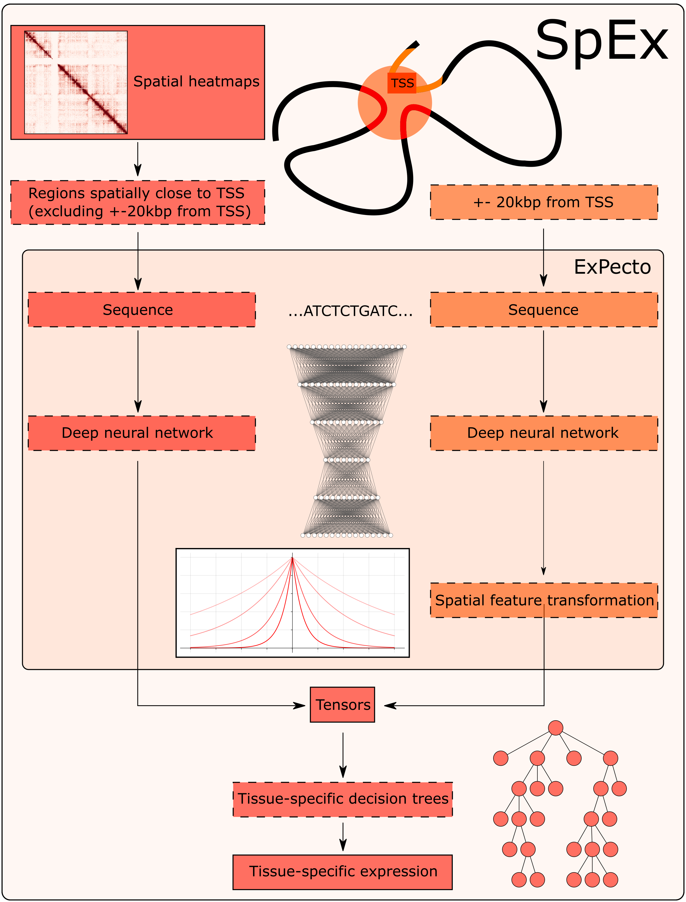

# SpEx - Spatial Gene Expression 

## Scientific Background

SpEx is an extension to the ExPecto[^1] deep learning model predicting tissue specific gene transcription levels from a DNA sequence. 

_"The ExPecto sequence-based expression prediction framework includes three components that act sequentially. First, a deep neural network epigenomic effects model scans the long input sequence with a moving window and provides an output of predicted probabilities for histone marks, TFs and DNase hypersensitivity profiles at each spatial position. Then, a series of spatial transformation functions summarize each predicted spatial pattern of chromatin profiles to generate a reduced set of spatially transformed features. Lastly, the spatially transformed features are used to make tissue-specific predictions of expression for every gene by regularized linear models (See Figure 1)."[^1]_


Figure from [^1].


The SpEx model extends ExPecto by incorporating the chromatin features which are spatially close to the gene TSS. The SpEx can use HiC and/or CHiA-PET experiments to calculate the spatial distance[^2] between gene loci. The chromatin features are grouped and summed based on the distance from the gene TSS and added to the input of regularized linear model (See Figure 2 & Figure 3).


<p align="center" width="100%">
    
</p>



The SpEx model improves the ExPecto Spearman correlation coefficient by 0.02-0.04.

## Installation

Install conda/miniconda, setup an enironment and install required libraries:
```
conda create -n spex python=3.9 -y
conda activate spex

conda install pandas scikit-learn -y
conda install -c pytorch pytorch -y
conda install -c bioconda pyfasta -y
conda install -c conda-forge -c bioconda cooler -y
pip install xgboost --no-deps
```
If you are going to use GSheet logging install:
```
conda install -c conda-forge gspread oauth2client -y
```

## Download Additional Data Files
Download Expecto Beluga model:
```
wget -O ./expecto/deepsea.beluga.pth https://zenodo.org/record/3402406/files/deepsea.beluga.pth?download=1 
```
Download and unzip the GRCh38 genome:
```
wget -P ./data/ https://hgdownload.cse.ucsc.edu/goldenpath/hg38/bigZips/hg38.fa.gz
gunzip ./data/hg38.fa.gz
```

## Building baseline Expecto predictions using GRCh38 reference genome
Activate conda environment and build the tensors
```
conda activate spex
python tensors.py --data_folder ./data_beluga_expecto_hg38
```
The `tensors.py` script will create tensor files in the `data_beluga_hg38/tensors` folder. The script can be stopped and restarted and any time. It should create `22826` tensor files.

Train the model on the specific tissue. `22` is the index of `Cells_EBV-transformed_lymphocytes` tissue at [GTex expression profile file](./expecto/geneanno.exp.csv)
```
python train.py --data_folder ./data_beluga_expecto_hg38 --target_index 22
```
The train command above should generate the following output if run on all the GRCh38 tensors files:
```
rmse: 2.2754224134616092 spearman: 0.8228664175595227 pval: 9.171787853466655e-245 pearson: 0.8324827603188578 pval: 1.2911859309770679e-255
```

## Extending the Expecto model with 3D data
Download the [in situ ChIA-PET on GM12878 condition RNA Pol II](https://data.4dnucleome.org/files-processed/4DNFIARR7LP4/) from the 4DNUCLEOME portal (assetion 4DNFIARR7LP4) in the mcool format and save it as `data/4DNFIARR7LP4.mcool` folder.

Build the tensor files again using the downloaded mcool file:
```
conda activate spex
python tensors.py --data_folder data_beluga_expecto_hg38_4DNFIARR7LP4 --mcool_filename data/4DNFIARR7LP4.mcool
```
Train the model on newly created tensors:
```
python train.py --target_index 22 --data_folder data_beluga_expecto_hg38_4DNFIARR7LP4
```
The output is:
```
rmse: 2.024098579591377 spearman: 0.8569319572771563 pval: 1.9035666380248422e-281 pearson: 0.8685409875705444 pval: 5.775754825860361e-298
```
Notice the Spearman correlation coefficient increase from `0.8228` to `0.8569`.

## Further research
Taking into consideration distant chromatin interactions improves the gene expression prediction. It has not escaped our notice that such phenomena can be used to benchmark and validate different Conformation Chromatin Capture (CCC) experiments and 3D chromatin modeling methods.

## License
The Expecto source code and resources are licensed according to the [`PRINCETON Academic Use SOFTWARE Agreement`](https://github.com/FunctionLab/ExPecto).

## Citation

If you use SpEx in your research, we kindly ask you to cite the following publication:

```
@article{chilinski2023enhanced,
  title={Enhanced performance of gene expression predictive models with protein-mediated spatial chromatin interactions},
  author={Chili{\'n}ski, Mateusz and Lipi{\'n}ski, Jakub and Agarwal, Abhishek and Ruan, Yijun and Plewczynski, Dariusz},
  journal={Scientific Reports},
  volume={13},
  number={1},
  pages={11693},
  year={2023},
  publisher={Nature Publishing Group UK London}
}
```

## References
[^1]: Zhou, J., Theesfeld, C.L., Yao, K. _et al._ Deep learning sequence-based ab initio prediction of variant effects on expression and disease risk. Nat Genet 50, 1171–1179 (2018). https://doi.org/10.1038/s41588-018-0160-6

[^2]: Adhikari, B., Trieu, T. & Cheng, J. Chromosome3D: reconstructing three-dimensional chromosomal structures from Hi-C interaction frequency data using distance geometry simulated annealing. BMC Genomics 17, 886 (2016). https://doi.org/10.1186/s12864-016-3210-4
